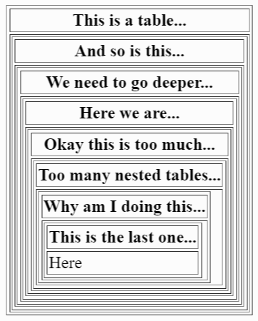

# Recursion Challenges
[Recursion](https://en.wikipedia.org/wiki/Recursion) occurs when a thing is defined in terms of itself or of its type. Complete the following challenges that use the concept of recursion.

## `table`s in `table`s
Create a table that contains a table that contains a table that contains a table that contains a table that contains a table that contains a table that contains a table (and so on).

It should look something like this:

Try changing the colors of the table cells, the number of rows, or anything else to make it look interesting!

## Recursion is cool
<iframe width="560" height="315" src="https://www.youtube.com/embed/nqy_hYDI0As?si=anfZCVNpU9ItFWtO" title="YouTube video player" frameborder="0" allow="accelerometer; autoplay; clipboard-write; encrypted-media; gyroscope; picture-in-picture; web-share" allowfullscreen></iframe>
