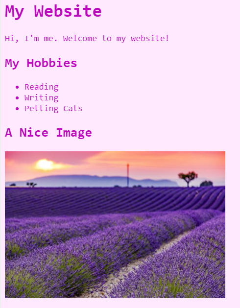

# Code-Along: An About Me Website
In this activity, use HTML and CSS to create a website about yourself!

>_Note: HTML ignores whitespace, so don't worry about extra lines or indentations between text!_

## Getting Started
[Click here to open the starter project](https://hytop.onrender.com/c/webstart)

That's it! You should be all set, and ready to code.

## First Challenge: Looking at the HTML
Make sure the **index.html** file is selected on the left to view the HTML code. Notice how the code in the HTML creates the text on the website. Everything in HTML goes between _tags_, which tell the website what type of element to display. 

The first thing to do is update the header text with your name! For example, if my name were **Sokka**, I could change the header so that it said **Sokka's Website**.

Update the code in the HTML section, _between_ the `<h1>` and `</h1>` tags. It should look something like this:

```html
<h1>Sokka's Website</h1>
```

When you make a change, the preview should update automatically. If you see your name - that's it! You're officially a web developer!

## Adding a Welcome Paragraph
Now it's time to add a totally new element. The **paragraph** element is used to display normal text on a webpage. Its tags are `<p>` and `</p>`, with text content between.

1. Make a new line underneath the `<h1></h1>`
1. Add a `<p>` opening tag on the new line
1. Enter some text that will be displayed
1. At the end of the line, add a `</p>` to close the paragraph element
1. Run the code, and verify that the message appears on the website!

The code should look something like this:

```html
<p>Hi, I'm me. Welcome to my website!</p>
```

## Adding a List of Hobbies
Next, it's time to add some information about yourself. Think of some hobbies or activities you enjoy, and then follow the instructions to list them on your website!

1. Add an `<h2></h2>` saying "My Hobbies" beneath the `<p></p>` element
    - This will display a slightly smaller header than `h1`
1. On the next line, add a `<ul>` opening tag, and make a new _indented_ line
    - Can you guess what the `ul` element will be? An unordered list!
1. Under the `<ul>`, add an `<li></li>` with one of your hobbies as the content
    - Can you guess what the `li` element will be? A list item!
1. Add at least one more `li` element on the next line
1. At the end of the list, add a `</ul>` to complete the element
1. Run the code, and verify that the list appears on the website!

The code should look something like this:

```html
<h2>My Hobbies</h2>
<ul>
    <li>Reading</li>
    <li>Writing</li>
    <li>Petting Cats</li>
</ul>
```

## Adding a Cool Image
This is looking rad, but what's missing? Almost every website has at least one image, and yours can too!

### Finding an Image
The first thing to do is find an image. Images on websites have URLs which tell the browser where to look for them. Follow the instructions below to find the URL (or _address_) of an image, and copy it.

1. Open a new browser tab and go to [Google Images](https://google.com/images/)
1. Search for something appropriate (such as "cats")
1. Click on the image you would like to use
1. When it appears, right click and select "Copy image address"
    - Do not copy the image itself, that will not work!

Now, the image address is stored on the clipboard. It will be possible to paste it into your website after adding some HTML.

### Creating the Image Element
Now that you have the image, it's time to add it to your website.

1. Make a new line under the `</ul>`
1. Add another `<h2>` saying "A Cool Image"
1. Make a new line under that
1. Add a new element: ``
1. After the `img`, before the `>`, type in `src=""`
1. Between the double quotes, _paste_ in the image URL
1. Run the code, and verify that your image appears on the website!

The code should look something like this:

```html
<h2>A Cool Image</h2>

```

## Changing the Background Color with CSS
Now the content of the page is looking pretty good, but it's not very stylish. One way to make the website look more fun and exciting is to use CSS! HTML is like the skeleton of a webpage, just the structure, and CSS is like the clothes that it wears, giving it style.

>Important Note: the color picker may malfunction, so be wary!

On the left side of the page, open the **style.css** file by clicking on it.

Take a look at the code so far. Try to figure out how to change the background color from `white` to another color, like `pink`!

The code should look something like this:

```css
* {
  background: pink;
}
```

## Changing More with CSS
CSS can change almost anything on a website. For this activity, update the text color, size, and font! All changes should take place in the **style.css** file.

### Updating the Text Color
Follow these instructions to change the text color on your website.

1. Find the line where the `background` color is set
1. Make a new line underneath that line (above the `}`)
1. Type in `color`, followed by a colon (`:`)
1. Make a space, and type in a new color (like `red`) followed by a semi-colon (`;`)

Run the code, and verify that the text color changes!

Note that every CSS _property_ follows the same structure: property name, colon, property value, semi-colon.

### Updating Font and Size
Next, update the font and size of the text by following the instructions below.

1. Make a new line under the `color` line (still above `}`)
1. Set a new property `font-family` to a value of `consolas`
    - property name, colon, property value, semi-colon
1. Make another new line, still above `}`
1. Set another new property `font-size` to a value of `18px`
    - property name, colon, property value, semi-colon
    - Can you guess what `px` means? Pixels!

Run the code, and verify that the text changes font and size! Feel free to try changing the numbers or the font to see what works.

The code should look something like this:

```css
* {
  background: pink;
  color: red;
  font-family: consolas;
  font-size: 18px;
}
```

## Resizing the Image
Sometimes, images from online are way too big. It is possible to resize them using CSS!

Add this code to the **style.css** file (at the bottom):

```css
img {
  height: 200px;
}
```

That should resize the image to a more appropriate height. Feel free to try changing the number to see what works.

## Using Custom Colors
Some basic colors are built into the web (like **pink** and **red**), but it is also possible to use custom colors! Each color can be represented as a _hexidecimal color code_, which is a hashtag (`#`) followed by six alphanumeric characters. The easiest way to find a specific color is to use a color picker, like [Google's color picker](https://www.google.com/search?q=color+picker)! Follow the steps below to update the colors on the website.

1. Open a new tab
1. [Search for "color picker" on Google](https://www.google.com/search?q=color+picker)
1. Select a color
1. Copy the HEX code  
  - 
1. Go to the **style.css** file
1. Paste the hex code where a color was
1. Refresh the preview, and verify that the new color appears on the website!
1. Repeat the steps above to change the color of the text to another custom color

The CSS code should look something like this:

```css
* {
  background: #ffbdbd;
  color: #bf3636;
  font-family: consolas;
  font-size: 18px;
}
```

## Finishing Up
Hopefully your website is looking good by now! It should look something like this:



Congratulations, you've successfully built your own website!

## Customization
If there is time remaining, there are a lot of additional updates to be made!

[Click here to see what can be customized.](Customization.md)
