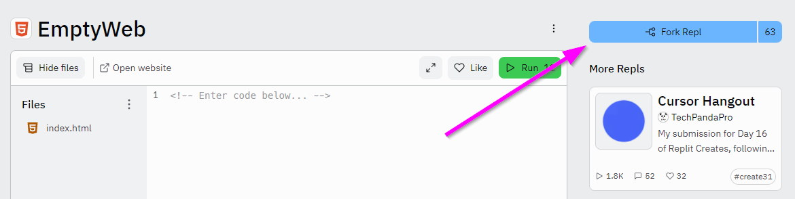
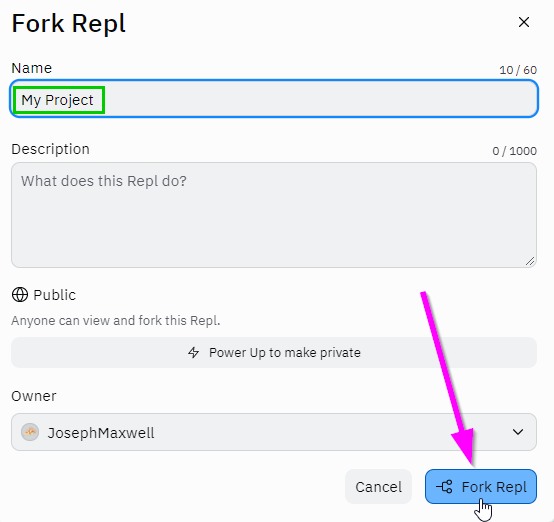
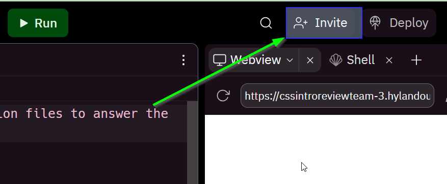
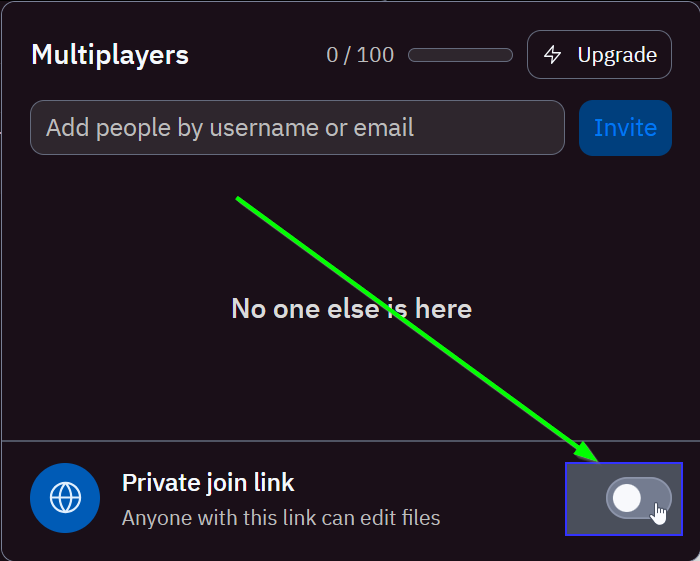
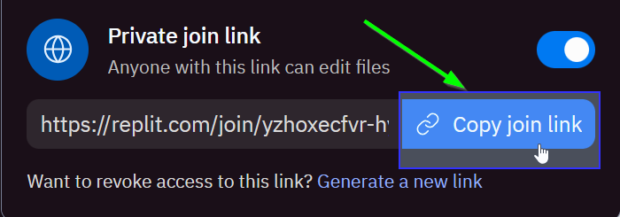

# Replit Introduction
Get started with Replit.

## Making a Repl Account
Before beginning, make sure you have a Repl account. You can follow [these instructions](https://hylandtechclub.com/ReplitSetup) to set one up if you do not have one.

## Getting Started
Start by creating a **Fork** of an empty project to get started, and sharing a **Multiplayer Link** to the project.

1. Go to [this empty Project](https://glitch.com/edit/#!/remix/emptyweb1011)
1. Click the "Remix" button in the upper right 
    
1. In the popup that appears, enter a new Name for the Repl, and click "Fork Repl"
    
1. On the next page, click the "Invite" button in the upper right  
    
1. In the window that appears, toggle the "Private join link" option
    
1. When the link appears, click the "Copy join link" button to copy the URL for the **Multiplayer Link**  
    

Once the **Multiplayer Link** has been copied, you can share it with your instructors. This will give them access to your code so they can help you.

## Adding Code
After creating a new Repl project, the next step is to add some code to it! Take a look at the [HTML Intro Challenge](HtmlIntroChallenge.md) for some guidance.
