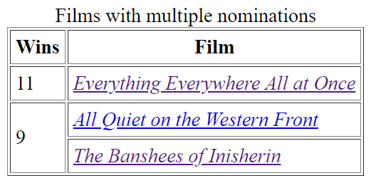
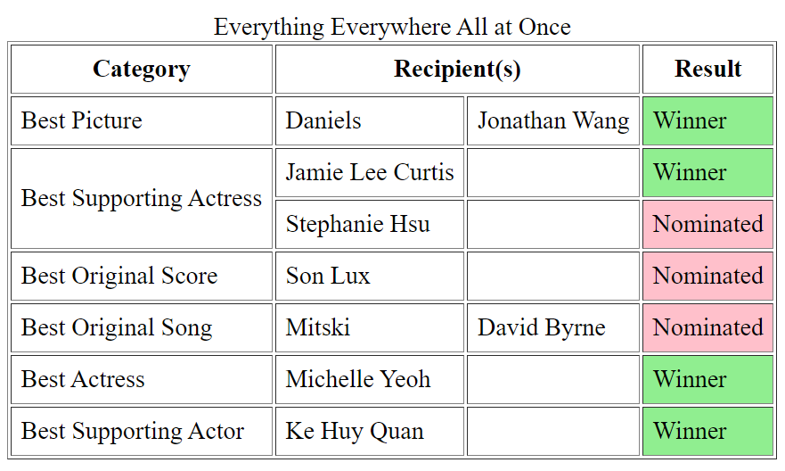
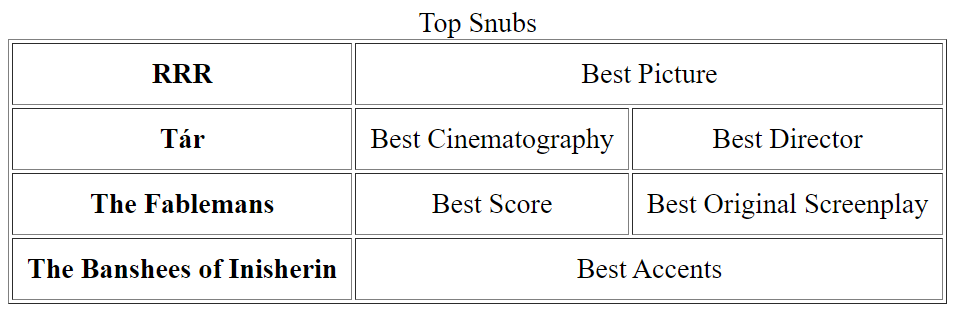
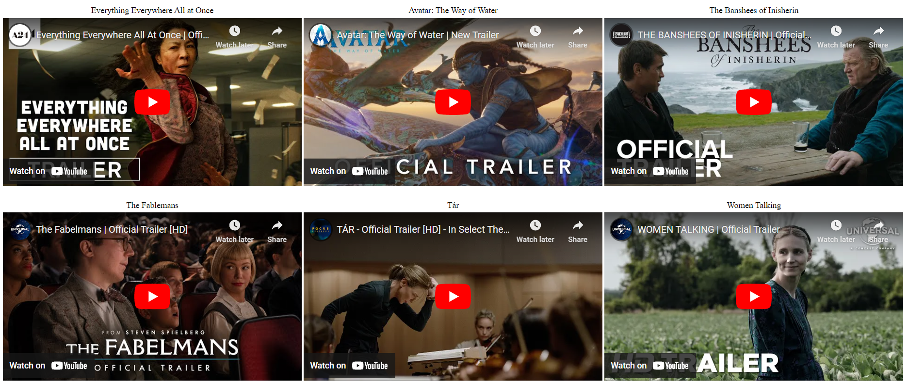

# Challenge: Oscars Website
Create a website for the [95th Annual Academy Awards](https://en.wikipedia.org/wiki/95th_Academy_Awards). Start by creating a new HTML file and adding the basic elements to it (including a header that says "95th Academy Awards"). Then, complete the exercises below on the webpage.

## Multiple Nominations Table
Recreate the table below.
 

In order to properly match the table from the image, research the following concepts:

- `cellpadding` attribute
- `caption` element
- `i` element
- `rowspan` attribute

Make sure to use the anchor element to hyperlink each film in the table.

## Everything Everywhere All at Once Table
Recreate the table below. 

In order to properly match the table from the image, research the following concepts:

- `colspan` attribute
- `bgcolor` attribute

## Top Snubs
Some people are angry about certain films not winning awards. Make a table about those films.

## Movie Trailers
Create a display of movie trailers for a selection of the Best Picture nominees. They should appear in line with each other, stacked in two rows and three columns. There should additionally be rows above each trailer, with centered film titles, and an empty row of space separating the two trailer rows.

It should look like this:

The Best Picture nominees to include are:

- Everything Everywhere All at Once
- Avatar: The Way of Water
- The Banshees of Inisherin
- The Fablemans
- Tár
- Women Talking
