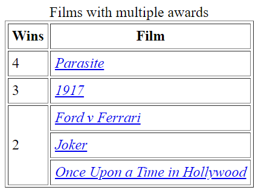
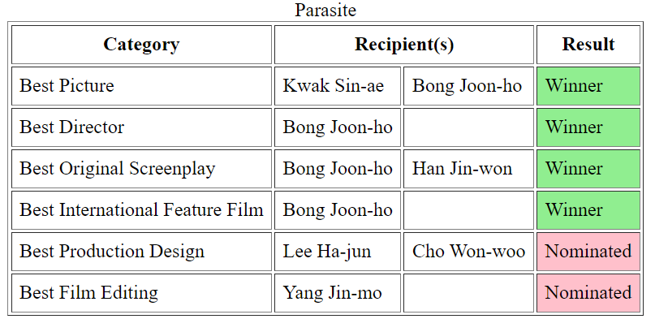

# Challenge: Oscars Website
Create a website for the 92nd Annual Academy Awards. Start by creating a new HTML file and adding the basic tags to it (including a header that says "92nd Academy Awards"). Then, complete the exercises below on the webpage.

>_Note: for an added challenge, try to recreate some of the tables from the [most recent Academy Awards](https://en.wikipedia.org/wiki/95th_Academy_Awards)!_

## Multiple Awards table
Recreate the table below.
 

In order to properly match the table from the image, research the following concepts:
- `cellpadding` attribute
- `caption` element
- `i` element
- `rowspan` attribute

Make sure to use the anchor tag to link each film in the table.

## Parasite table
Recreate the table below. 

In order to properly match the table from the image, research the following concepts:
- `colspan` attribute
- `bgcolor` attribute

## Movie Trailers
Create a display of movie trailers for each of the Best Picture nominees. They should appear in line with each other, stacked on top.

It should look like this:  

