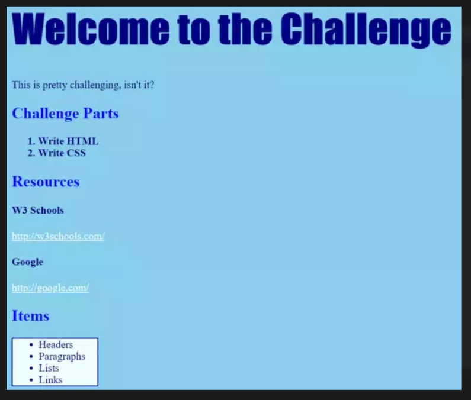

# Challenge: Style a Website from an Image
For this challenge, you'll take an image of a website, and write CSS for it to match the image.

## Instructions
Recreate the webpage from this image:  

### HTML
Start by filling in the HTML content. You will need to use headers, paragraphs, lists, and hyperlinks!

### CSS
Once the basic structure is filled out, create a CSS file and link it in the HTML. Then, start adding the styles to the page.

## Requirements
- Put these styles in their own **external stylesheet**. _HINT: you'll have to create a CSS file in the same folder as the HTML file, and _link_ it in the HTML._
- Colors do **NOT** have to match exactly

## Uncovered Styles
There are a few styles on the page that we haven't officially covered. See if you can use the internet to figure out how to use those properties.

### More Properties
If you finish the whole challenge, and an instructor checks it, you can start exploring more CSS properties here: https://www.w3schools.com/cssref/

Update your pages with some additional styles!
