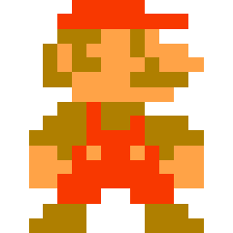

# Pixels: Follow-Along Activity
Follow the instructions to create a very simple pixel PAC-MAN!


## Pixel Art Examples
#### Original Mario


All art for video games was once hand-coded, pixel-by-pixel!

#### Panda
(animated: https://i.pinimg.com/originals/ab/dd/7d/abdd7da2f2fd574cb5b92f61b01d625d.gif)


Now, some developers copy this style for their own art

#### Cityscape  


Pixel art can be used for almost anything!

## Setup
Start by copying [this starter project](https://hytop.onrender.com/c/pixel).

### Starter Code
The code to start looks like this:

**index.html**

```html
<html>
  <head>
    <link href="style.css" rel="stylesheet" type="text/css" />
  </head>
  <body>
    <div id="main">
      
    </div>
  </body>
</html>
```

**style.css**

```css
#main {
  height: 100px;
  width: 100px;
  border: 2px solid orange;
}
```

Run the program to see how it looks! There should be a small orange square outline on the page. Notice that the `#main` selector is _selecting_ the `<div>` with the `id` attribute of `main`, and that ruleset is doing the styling.

Make the following updates in the **style.css** file:

1. Set the `height` to `400`
1. Set the `width` to `400`
1. Set the `border` color to `black`

After updating, the CSS should look something like this:

```css
#main {
    width: 400px;
    height: 400px;
    border: 2px solid black;
}
```

## Rows and Columns for the Grid
The goal for the `#main` container `<div>` is for it to have a grid of 4x4 "pixel" squares. Doing some quick math, these "pixel" squares should actually be 100 pixels wide and 100 pixels tall (`400/4=100`). So there should be four row `<div>`s, and each one should have four cell `<div>`s!

1. Open the **index.html** file for editing
1. Within the `<div id="main">`, create four child `<div>` elements
    - Each of these `<div>` elements represents one row
1. Add a `class` attribute with a value of `horizontal` for each "row" `<div>`
1. Within each of those child `<div>` elements, create four grandchild `<div>` elements
    - Each of these `<div>` elements represents one cell
1. Add a `class` attribute with a value of `cell` for each "cell" `<div>`

>Note: Copy/Paste will make this much faster!

The full `<div id="main">` in the **index.html** file should look something like this:

```html
<div id="main">
    <div class="horizontal">
        <div class="cell"></div>
        <div class="cell"></div>
        <div class="cell"></div>
        <div class="cell"></div>
    </div>
    <div class="horizontal">
        <div class="cell"></div>
        <div class="cell"></div>
        <div class="cell"></div>
        <div class="cell"></div>
    </div>
    <div class="horizontal">
        <div class="cell"></div>
        <div class="cell"></div>
        <div class="cell"></div>
        <div class="cell"></div>
    </div>
    <div class="horizontal">
        <div class="cell"></div>
        <div class="cell"></div>
        <div class="cell"></div>
        <div class="cell"></div>
    </div>
</div>
```

## Styling the Cells
Now that the HTML structure is there, it's time to style the grid with CSS!

1. Open the **style.css** file for editing
1. Under the existing contents, create a new **ruleset** for each cell
    - Selector: `.cell`
    - Curly brackets
1. Set the `width` and `height` properties of each cell to `100px`
1. For testing purposes, set the `background` property to `blue`

The new ruleset in the **style.css** file should look something like this:

```css
.cell {
    height: 100px;
    width: 100px;
    background: blue;
}
```

## Aligning the Cells
Currently, each cell `div` will stack vertically. This is the default behavior for HTML `div` elements. Instead, the "cell" elements should display horizontally within each row. CSS Grid layout allows this style.

>Resource: [CSS Grid Layout](https://developer.mozilla.org/en-US/docs/Web/CSS/CSS_Grid_Layout/Basic_Concepts_of_Grid_Layout)

1. Open the **style.css** file for editing
1. Above the `.cell` ruleset, create a new **ruleset** for each row
    - Selector: `.horizontal`
    - Curly brackets
1. Set the `display` property of each row to `grid`
    - This tells the webpage that each row will have the grid layout
1. Set the `grid-template-columns` property of each row to `1fr 1fr 1fr 1fr`
    - This will determine the number of columns in each row
    - The 4 `1fr` mean that there are 4 columns, each taking one _fraction_ of the available width (for real)
1. Remove the `width` from the `.cell` ruleset as it is no longer necessary

The updated rulesets in the **style.css** file should look something like this:

```css
.horizontal {
    display: grid;
    grid-template-columns: 1fr 1fr 1fr 1fr;
}

.cell {
    height: 100px;
    background: blue;
}
```

Now, the entire main container should be blue, because each cell is 100x100 pixels and they stack properly!

## Filling Out the Grid with Colors
Now that each cell block is in the right place, it will be possible to set each color in the grid!

Remember, this is what PAC-MAN should look like on the 4x4 grid:


1. Open the **index.html** file for editing
1. Add a `class` of `black` to each black cell
1. Add a `class` of `yellow` to each yellow cell
    - Note that the `div` will now have two classes: `cell` and `yellow`
    - Two classes can be set with a space between them: `class="cell yellow"`
1. Open the **style.css** file for editing
1. Remove the blue `background` from the "cell" elements
1. Create a new **ruleset** for "black" cells
    - Selector: `.black`
1. In the `.black` ruleset, set the background color to `black`
1. Create a new **ruleset** for "yellow" cells
    - Selector: `.yellow`
1. In the `.yellow` ruleset, set the background color to `gold`

That's it! Refresh the page and PAC-MAN should appear in the grid.

## Final Code
At the end of the activity, the code should look something like this:

**index.html**

```html
<html>
    <head>
        <link href="style.css" rel="stylesheet" type="text/css">
    </head>
    <body>
        <div id="main">
            <div class="horizontal">
                <div class="cell"></div>
                <div class="cell yellow"></div>
                <div class="cell black"></div>
                <div class="cell yellow"></div>
            </div>
            <div class="horizontal">
                <div class="cell yellow"></div>
                <div class="cell yellow"></div>
                <div class="cell yellow"></div>
                <div class="cell yellow"></div>
            </div>
            <div class="horizontal">
                <div class="cell yellow"></div>
                <div class="cell yellow"></div>
                <div class="cell"></div>
                <div class="cell"></div>
            </div>
            <div class="horizontal">
                <div class="cell"></div>
                <div class="cell yellow"></div>
                <div class="cell yellow"></div>
                <div class="cell yellow"></div>
            </div>
        </div>
    </body>
</html>
```

**style.css**

```css
#main {
    width: 400px;
    height: 400px;
    border: 2px solid black;
}

.horizontal {
    display: grid;
    grid-template-columns: 1fr 1fr 1fr 1fr;
}

.cell {
    height: 100px;
}

.black {
    background: black;
}

.yellow {
    background: gold;
}
```
