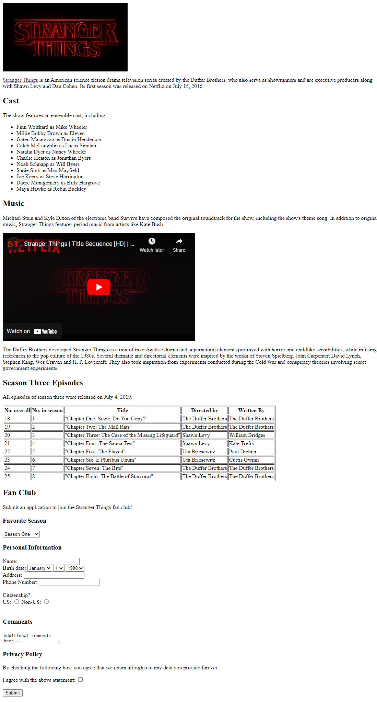

# Challenge: Reverse Engineering a Webpage
Here is an image of a webpage:

(view the full-size image here: <a href="StrangerThingsSite.png">Stranger Things Site</a>)

Your goal is to replicate the webpage using HTML! Start by forking [this empty Glitch project](https://glitch.com/edit/#!/remix/emptyweb101). Then, start adding the necessary code to create your webpage!

## Notes
It is not necessary to have each part of the text/content match the image exactly. The important thing is recognizing each element and creating it with HTML! The [HTML Cheatsheet](HtmlCheatsheet.md) can be a big help.

## Helpful Resources
In order to successfully recreate the site, utilize these resources.

- The Stranger Things image is here: [https://upload.wikimedia.org/wikipedia/commons/thumb/3/38/Stranger_Things_logo.png/640px-Stranger_Things_logo.png](https://upload.wikimedia.org/wikipedia/commons/thumb/3/38/Stranger_Things_logo.png/640px-Stranger_Things_logo.png)
- The "Stranger Things" link at the top should navigate here: [https://www.netflix.com/title/80057281](https://www.netflix.com/title/80057281)
- The title sequence video (embedded on the page) is here: [https://www.youtube.com/watch?v=-RcPZdihrp4](https://www.youtube.com/watch?v=-RcPZdihrp4)
- Each of the dropdowns on the page should contain the appropriate options
    - "Favorite Season" should have seasons one through four
    - "Birth date" should have each month (Jan-Dec), each possible day (1-31), and years 1900-2022

## Bonus Challenge 1
If an instructor checks your page and you have successfully completed the challenge, you can work on updating your website so that it contains information about _your_ favorite TV show, movie, book series, or anything else! Try to keep the same general layout, but feel free to change all the information. If desired, you can also skip this challenge and move onto the next one.

## Bonus Challenge 2
For this challenge, create a separate HTML page for the fan club application, and link to it from the main page. This will make things a little cleaner!

## Bonus Challenge 3
For this challenge, create a "Rating" column in the episodes table, and link to a review for each episode, part, or installment.

## Bonus Challenge 4
If you finish Bonus Challenge 3, you can create your own review pages for each of installment.Link to those new pages instead of the reviews. These pages should include brief descriptions of the installment, pictures, review scores, and reviews.
