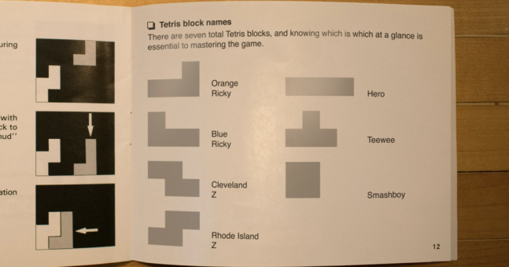
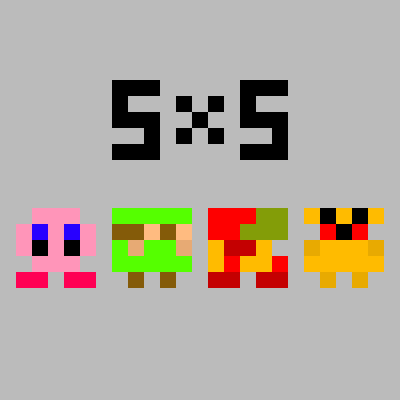

# Self-Paced Work: Pixel Updates
Update the grid with some different artwork.

## Part 1 - Red PAC-MAN
Instead of yellow, make PAC-MAN red!

1. Change the name of the `yellow` class to `red`
    - Change the class attribute value for each yellow `
` in the HTML
    - Change the `.yellow` ruleset so that it points to elements with a class of `red`
1. Change the background color from `gold` to `red` for those cells

## Part 2 - Smaller PAC-MAN
Make updates so that each pixel in the grid is 50x50 instead of 100x100.

1. Set the `width` and the `height` of the main `
` to `200px` instead of `400px`
    - This is in the `#main` ruleset
1. Set the `height` of each cell to `50px` instead of `100px`
    - This is in the `.cell` ruleset

## Part 3 - Make Your Own Sprite
Instead of PAC-MAN, create a totally different 4x4 pixel art character! Feel free to copy one of the designs from [here](https://www.google.com/search?tbm=isch&q=4x4pixels+blogspot+pixelheroes).

For a good starting point, try recreating one of the Tetris blocks:

1. Open the **style.css** file for editing
1. Under the existing contents, create a new class **ruleset** for each color used in the sprite
    - For example, in the long Tetris block, there could be a `.green` selector
1. In each color ruleset, set the background color to the appropriate color
    - Property: `background`
    - Value: color for the cell
1. In the HTML file, add an appropriate color class to each `
`
    - For example, in the long Tetris block, the third cell in each row could have the `green` class

## Challenge - Make a 5x5 Sprite
It's hard to represent a character in only 32 cells. Instead of using a 4x4 grid, update the code so that it's 5x5. Then, create a new 5x5 sprite using the extra space!

1. Open the **style.css** file for editing
1. Update the `#main` ruleset to have a `height` and `width` of `250px`
1. In the `.horizontal` rule, update the grid template columns to specify 5 columns instead of 4
1. Open the **index.html** file for editing
1. Add an additional "cell" `
` to each existing "row" `
`
    - Each new "cell" `
` should have a `class` attribute with value `cell`
1. Add an additional "row" `
` as a child of the `
`
    - The "row" `
` should have a `class` attribute with the value `horizontal`
1. Within the new "row" `
`, add 5 "cell" `
` elements as its children
1. Update all the classes for the cells to reflect the new sprite
1. Try to create a new 5x5 character!

Theoretically, this grid could be as big as is desired... try to make it fit whatever size makes the most sense!
